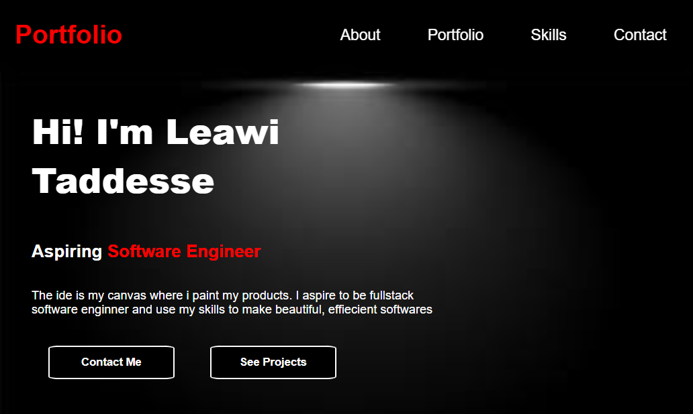

# Personal Portfolio Page

A project built as part of the **FreeCodeCamp Responsive Web Design Certification**.  
This page is a simple personal protfolio page built with HTML and CSS containing some of my skills, projects and how to contacting me.

---

## 📸 Preview
 <!-- optional: add a screenshot of your project -->

---

## 📖 Features
- Responsive design (works on mobile, tablet, and desktop)
- Clean and simple layout
- Modern looking layout

---

## 🛠️ Built With
- HTML5
- CSS3

---

